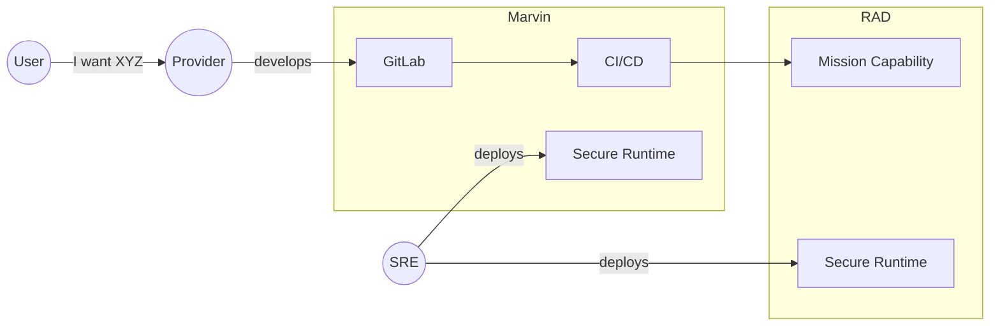
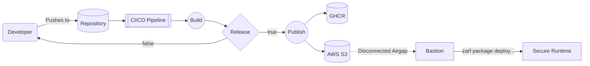

# CDP Process Flow

CDP-Core provides a secure runtime environment, it could nominally be integrated into the entire software development lifecycle as depicted.

```mermaid
flowchart LR
    user((User))
    sre((SRE))
    provider((Provider))
    subgraph Marvin
    GitLab --> CI/CD
    secureRuntimeA[Secure Runtime]
    end
    subgraph RAD
    app[Mission Capability]
    secureRuntimeB[Secure Runtime]
    end
    sre --deploys--> secureRuntimeA
    sre --deploys--> secureRuntimeB
    user --"I want XYZ"--> provider
    provider --develops--> GitLab
    CI/CD --> app
    click secureRuntimeA "https://repo1.dso.mil/big-bang/bigbang" "helm install bigbang..."
    click secureRuntimeB "[zarf.dev](https://github.com/defenseunicorns/uds-package-dubbd)" "zarf package deploy oci://dubbd..."
```

## CDP-Core DevOps Flow

```mermaid
flowchart LR
    dev(Developer) -->|Pushes to| repo[(Repository)]
    repo --> pipeline[[CI/CD Pipeline]]
    pipeline --> build-job((Build))
    build-job --> release{Release}
    release -->|false| dev
    release -->|true| publish-job((Publish))
    publish-job --> artifacts[(GHCR)]
    publish-job --> s3[(AWS S3)]
    s3 -.->|Disconnected Airgap| box[Bastion]
    box -->|zarf package deploy...| secureRuntime[Secure Runtime]
```